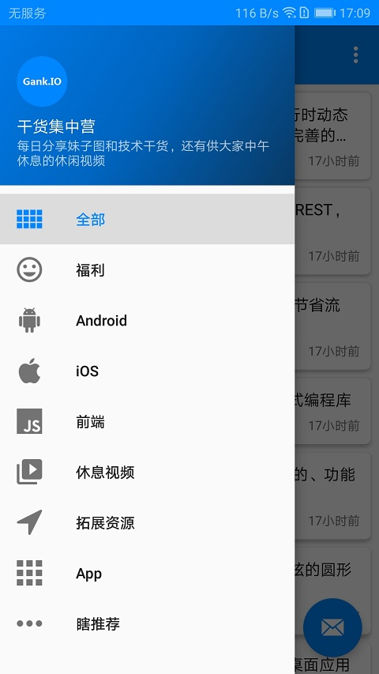
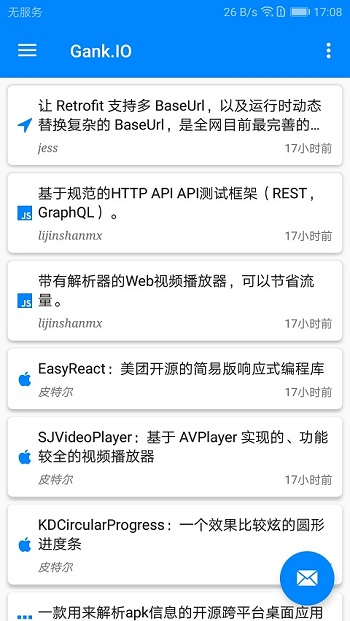
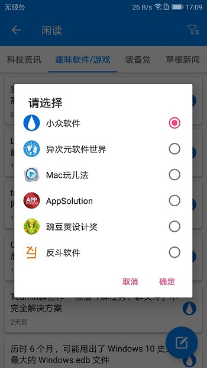

# GankIO —— 干货集中营
借助 [Gank.IO](https://gank.io/) 提供的 API 使用 RxJava + Retrofit + Okhttp + Glide + MVP 构建开发的一个 Android 客户端。

## 下载 ##
[干货集中营(Gank.IO)](./Gank.IO-v3.6.apk)

## 预览 ##
#### 1. 干货分类： ####

#### 2. 妹子福利： ####

#### 3. 每日力推： ####

#### 4. 闲读： ####

## 第三方依赖 ##
* [Gson](https://github.com/google/gson)
* [Glide](https://github.com/bumptech/glide)
* [Okhttp3](https://github.com/square/okhttp)
* [Retrofit](https://github.com/square/retrofit)
* [Rxjava2](https://github.com/ReactiveX/RxJava)
* [PhotoView](https://github.com/chrisbanes/PhotoView)
* [RxPermissions](https://github.com/tbruyelle/RxPermissions)
* [SmartRefreshLayout](https://github.com/scwang90/SmartRefreshLayout)
* [Logger](https://github.com/orhanobut/logger)

## 感谢 ##
* [代码家](https://github.com/daimajia)
* [干货集中营](https://gank.io/)

